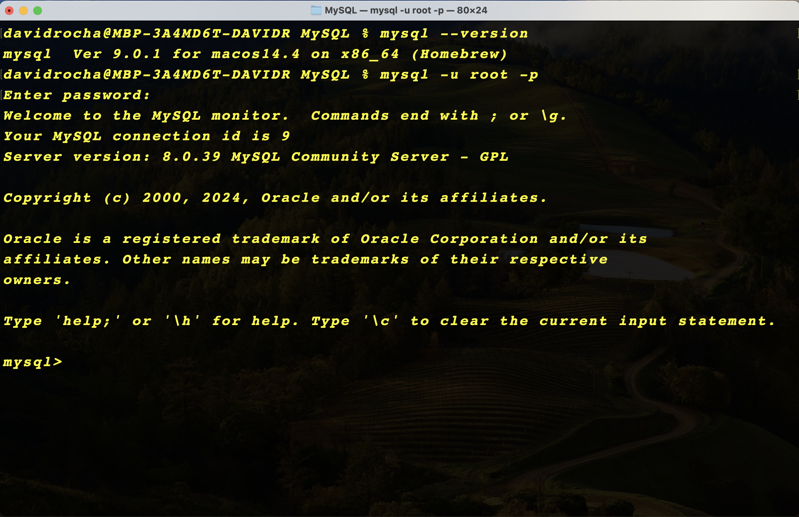
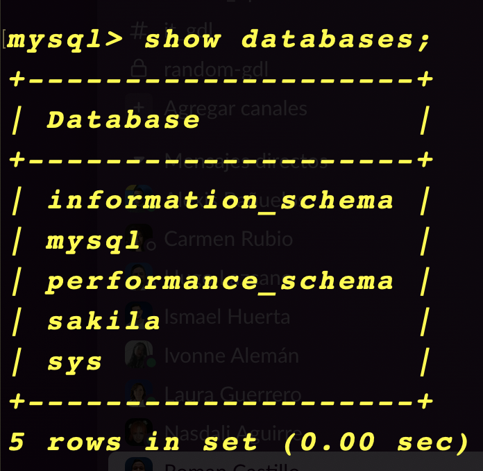
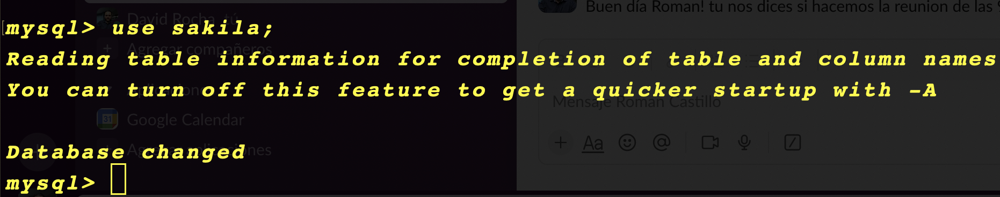
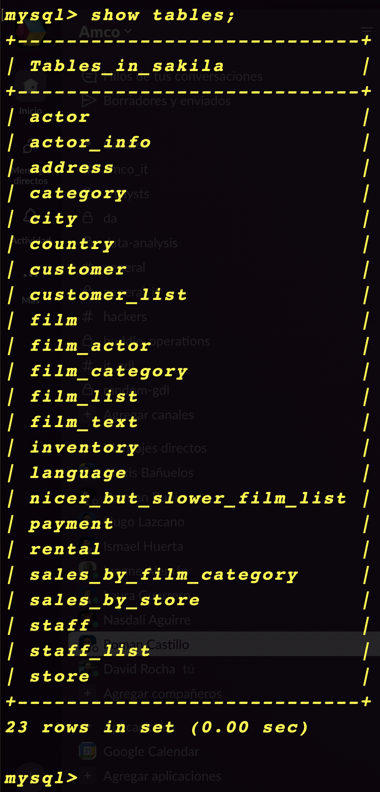

# MySQL
1. Install MySQL on Local Environment 
    * Download and install MySQL server and MySQL client tools for your operating system:  
    * Start the MySQL server and verify the installation.
    * Secure the installation by setting a root password and adjusting security settings (e.g., removing test databases and anonymous users).
    * __Task: Verify the installation by logging into MySQL from the command line:__
  

---

2. Download and Load the Sakila Sample Database
    * Download the Sakila sample database from the official MySQL site.
    * Unzip the Sakila database files
    * Load the database into MySQL: 
      + mysql -u root -p < /path/to/sakila-schema.sql
    * Insert the data into the database:
      + mysql -u root -p sakila < /path/to/sakila-data.sql
    * __Task: Verify the Sakila database was installed successfully by listing the available databases and selecting it:__
      - __SHOW DATABASES;__
      - __USE sakila;__ 

---