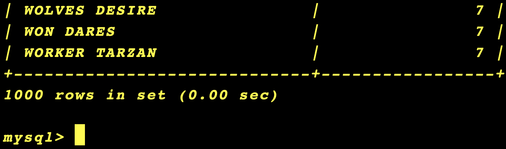

# MySQL
1. Install MySQL on Local Environment 
    * Download and install MySQL server and MySQL client tools for your operating system:
      + Windows: __(Own PC)__
      + macOS: Use brew install mysql if you have Homebrew. __(AMCO Lap)__  
    * Start the MySQL server and verify the installation.
    * Secure the installation by setting a root password and adjusting security settings (e.g., removing test databases and anonymous users).
    * __Task: Verify the installation by logging into MySQL from the command line:__
      - __mysql -u root -p__
    
  

---

2. Download and Load the Sakila Sample Database
    * Download the Sakila sample database from the official MySQL site.
    * Unzip the Sakila database files
    * Load the database into MySQL: 
      + mysql -u root -p < /path/to/sakila-schema.sql
    * Insert the data into the database:
      + mysql -u root -p sakila < /path/to/sakila-data.sql
    * __Task: Verify the Sakila database was installed successfully by listing the available databases and selecting it:__
      - __SHOW DATABASES;__
      
      - __USE sakila;__ 
      
      

---

3. Perform Queries Using the Command Line
    * Execute basic SQL queries on the Sakila database directly from the MySQL command line:
      + Retrieve all actors from the actor table:
        - SELECT * FROM actor;
        
        
      + Count the number of films in the film table:
        - SELECT COUNT(*) FROM film;
        
      + Find all customers whose last name is "Smith":
        - SELECT * FROM customer WHERE last_name = 'Smith';
        
    * __Task: Run at least five different queries, including:__
      + __SELECT with JOIN between rental and customer.__
      
      + __GROUP BY and HAVING to find the number of rentals per store.__
      
      + __ORDER BY to sort movies by rental duration.__
      
      
      
      
      
      

---

4. Exporting Data from MySQL
    * __Learn how to export query results to a file using the command line.__
      + "__SELECT__ "Columnas a elegir o todo" __INTO OUTFILE__ "Ruta/nombre.sql" __FROM__ "tabla"__;__ 
      
    * __Task: Export a list of all films, including title and rental duration, to a CSV file:__
      + __SELECT__ title, rental_duration __INTO OUTFILE__ "/Users/davidrocha/Desktop/VSC/MySQL/src/sakila/films.csv" __FIELDS TERMINATED BY__ ',' __LINES TERMINATED BY__ '\n' __FROM__ film __;__
        - Al momento de guardar el archivo se encontro con el siguiente error:
        
        
        Esto se debe al tipo de seguridad con el que se configuro el cliente de MySQL.
      - Se modifico el archivo __/usr/local/etc/my.cnf__ agregando una ruta existente, tambien dejandolo libre y sigue marcando el valor NULL en la BD. Cabe mencionar que esto se le pregunto por ultima instancia a ChatGPT y tampoco funciono su recomendacion.
      

  * Para realizar la peticion del Task se realizo la exportacion mediante el Workbench
  

      

---

      

      